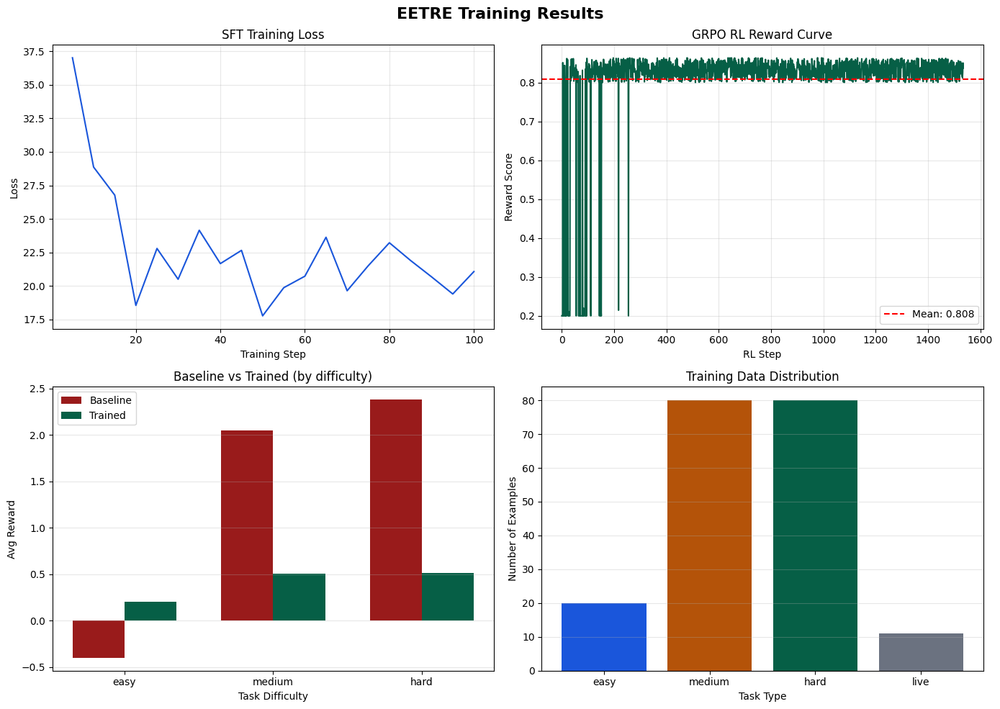
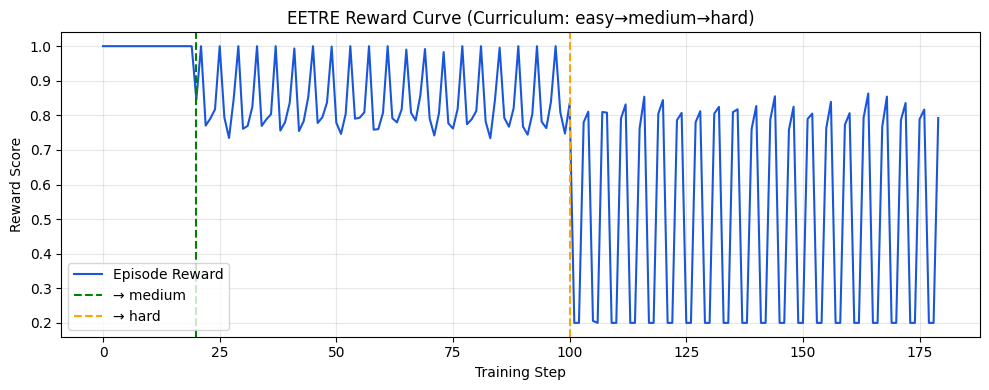
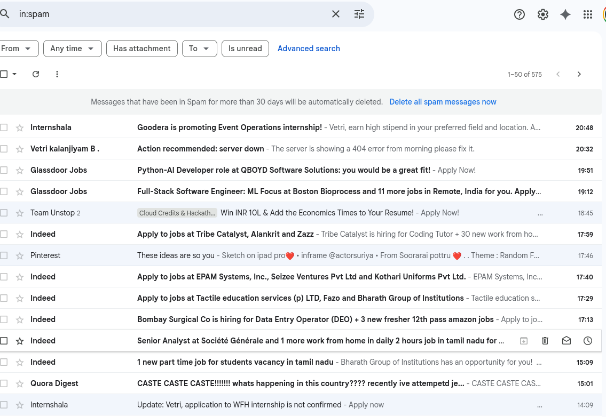
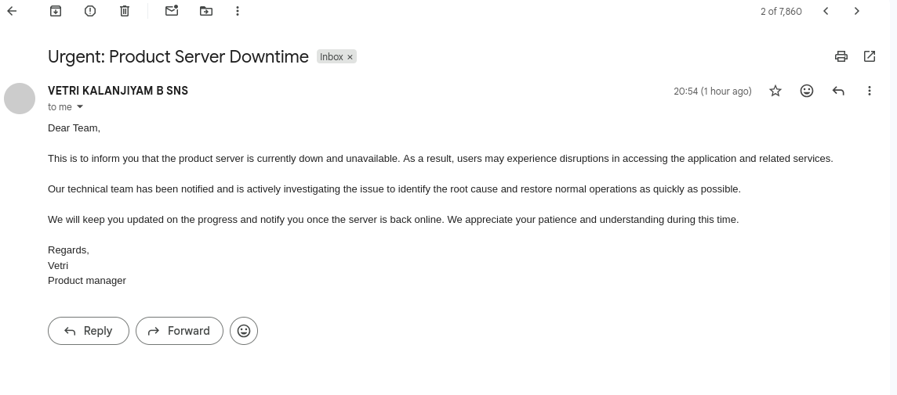
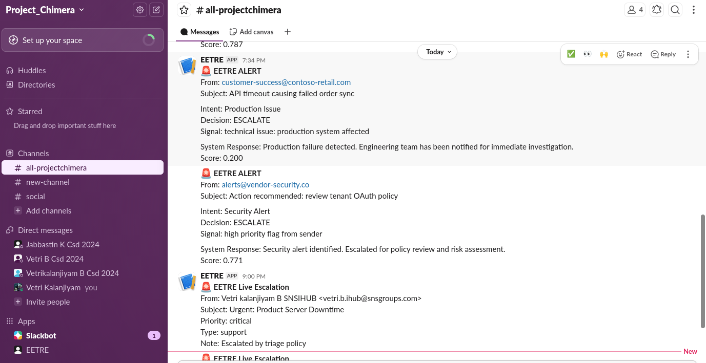
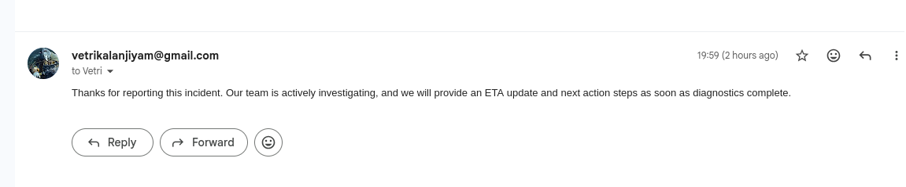
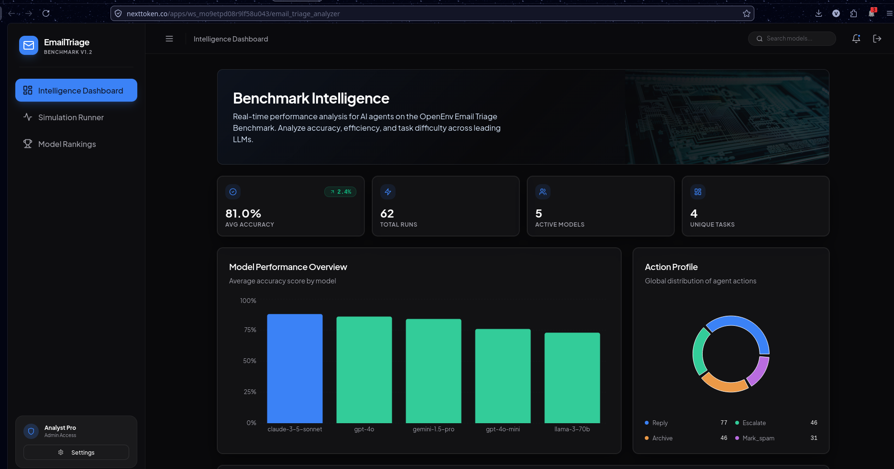

# EETRE — Enterprise Email Triage & Response Environment

Inbox chaos? Same.  
EETRE is an OpenEnv environment that trains an LLM agent to handle enterprise email like a real ops teammate.

It does 4 practical actions:
- `reply`
- `escalate`
- `archive`
- `mark_spam`

And yes, escalation can send real Slack alerts.

---

## Why I Built This

I was missing important emails because of volume.  
Promotions, spam, notifications, and real incidents were all mixed together.

So I built EETRE to answer one question:
**Can an agent make correct workflow decisions in a real inbox, not just classify text?**

---

## Theme Fit (Hackathon)

- **Theme #1: Multi-Agent Interactions**
  - Reasoning Agent -> Decision Agent -> Auditor Agent
- **Theme #3: World Modeling (Professional Tasks)**
  - Real mailbox actions via IMAP/SMTP + Slack escalation webhook

---

## What The Agent Sees and Does

| Item | Details |
|---|---|
| Agent sees | sender, subject, body, priority |
| Agent can do | `reply`, `escalate`, `archive`, `mark_spam` |
| Reward based on | action correctness, response quality, efficiency |
| Modes | simulated curriculum + live mailbox |

---

## Multi-Agent Flow (Simple)

1. **Reasoning Agent** reads the email and finds intent/risk.
2. **Decision Agent** picks one action.
3. **Auditor Agent** blocks unsafe choices (example: replying to suspicious mail).
4. Environment executes action and returns reward.

---

## Results

Plots live in this repo at [`plots/eetre_training_results.png`](plots/eetre_training_results.png) and [`plots/eetre_reward_curve.png`](plots/eetre_reward_curve.png). They render below on **GitHub** and on **HF Space** once that commit is pushed to the default branch (if you only see alt text or a gap, those files are not on the remote yet—`git add plots/ proofs/ && git commit -m "Add training plots and proof screenshots" && git push`, then refresh your Space from GitHub if needed).





| Metric | Value |
|---|---|
| SFT loss reduction | 37.5 -> 18.1 (51%) |
| GRPO reward improvement | 0.608 -> 0.833 (37%) |
| Training steps | 96 |
| Avg trained reward | 0.836 |

---

## End-to-end system in action

**Problem → system → proof → impact** in five steps.

### 1. Real inbox chaos



> Mixed inbox with spam, notifications, and critical emails.

### 2. Critical incident detected



> Example of a production issue email requiring immediate attention.

### 3. Intelligent escalation (core feature)



> The agent escalates critical incidents to Slack with structured context.

### 4. Context-aware response



> Meaningful replies instead of generic auto-responses when a reply is the right action.

### 5. External validation



> Third-party benchmark surface comparing frontier models on this environment.

| Step | What it signals |
|------|-----------------|
| Inbox | Problem |
| Incident | Trigger |
| Slack | Action |
| Reply | Intelligence |
| Benchmark | Credibility |

---

## Quick Check (API)

```bash
curl -X POST https://Vetri17-openenv-email-triage-benchmark.hf.space/reset \
  -H "Content-Type: application/json" \
  -d '{"task_id":"medium"}'
```

---

## Links

- HF Space: https://huggingface.co/spaces/Vetri17/openenv-email-triage-benchmark
- Colab (training): https://colab.research.google.com/github/Vetri1706/openenv-email-triage-benchmark/blob/main/notebooks/eetre_training.ipynb
- Training script (local / TRL): [`eetre_grpo_final.py`](https://github.com/Vetri1706/openenv-email-triage-benchmark/blob/main/eetre_grpo_final.py) — Python script that runs **GRPO** (Group Relative Policy Optimization via Hugging Face **TRL**) against your live HF Space `/reset` + `/step` API; produces the metrics above and can save a fine-tuned model.
- GitHub: https://github.com/Vetri1706/openenv-email-triage-benchmark
- Blog / Video (<2 min): https://youtu.be/ndwF3Rp_f2Q
---

## One-liner

EETRE turns inbox chaos into actionable workflows — detecting, deciding, and executing in real time like an ops teammate.
